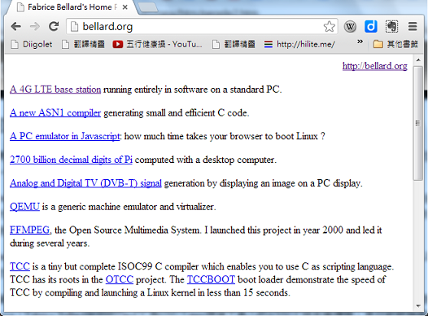

## QEMU的創造者–Fabrice Bellard

如果說 43 歲的我還可以像青少年一樣有偶像的話，那Fabrice Bellard1 2 絕對是我永遠的偶像，這位法國籍的程式設計師，單槍匹馬創造出了一系列讓人驚訝的軟體。

Fabrice Bellard 創造過甚麼軟體呢？您可以從搭他的網站3看到他的作品，其中最知名的是 QEMU 這個虛擬機，另外還有 TinyCC  這個微小又強大的 C 語言編譯器，另外他還能讓 Linux 直接在瀏覽器中用 JavaScript 把整個作業系統 Boot 起來，這樣的技術根本就像神乎其技一般，讓我們嘆為觀止，您可以從 <http://bellard.org/> 中看到他的作品。

Fabrice Bellard 出生於1972年法國的Grenoble地區。在高中就讀期間開發了著名的可執行壓縮程序LZEXE，這是當年DOS上第一個廣泛使用的文件壓縮程序。 

大學就讀於巴黎高等綜合理工學院，後在國立巴黎高等電信學院攻讀。 1996年,他編寫了一個簡潔但是完整的C編譯器和一個Java虛擬機Harissa。Fabrice Bellard發明的TinyCC是GNU/Linux環境下最小的ANSI C語言編譯器，是目前號稱編譯速度最快的C編譯器。

1997年他提出了最快速的計算圓周率的演算法，是Bailey-Borwein-Plouffe 公式的變體。

在計算圓周率的過程中，Fabrice Bellard使用改良後的查德諾夫斯基方程演算法來進行圓周率的計算，並使用Bailey-Borwein-Plouffe 演算法來驗證計算的結果。為了紀念他對圓周率演算法所作出的傑出貢獻，Fabrice Bellard所使用的改良型演算法被命名為Fabrice Bellard演算法，這種演算法是目前所有圓周率演算法中最快的一種，這個計算N位PI的公式比傳統的BBQ演算法要快47%。

1998年編寫了一個簡潔的OpenGL實現TinyGL. 2000年,他化名Gerard Lantau，創建了FFmpeg項目。FFmpeg 單詞中的FF 指的是Fast Forward，FFmpeg這個2000年發起著名的開源多媒體播放器項目， 是MPlayer的姊妹項目。這是一個如此重要的成就，沒有這個項目，就沒有我們今天廣為使用的暴風影音等播放器。這個多平台、多功能的多媒體編碼解碼器由Fabrice Bellard發起並管理，現在是由Michael Niedermayer在進行維護。

2003年,開發了Emacs克隆版QEmacs。

2004年,他編寫了一個只有138KB的啟動載入程序TCCBOOT，可以在15秒內從原始碼編譯並啟動Linux系統。

2005年,用普通PC和VGA卡設計了一個數字電視系統。

2009年12月31日，他聲稱打破了圓周率計算的世界紀錄，算出小數點後2.7萬億位，僅用一台普通PC機。他使用的個人PC價格不到2000歐元，僅用了116天，就計算出了PI的小數點後第2.7萬億位，超過了由目前排名世界第47位的T2K Open 超級計算機於2009年8月17日創造的世界紀錄。新紀錄比原紀錄多出1200億位，然而，他使用的這台桌面電腦的配置僅為：2.93GHz Core i7 CPU，6GB內存，7.5TB硬碟!

2011年，他單用JavaScript寫了一個PC虛擬機 Jslinux。這個虛擬機模擬了一個32位的x86兼容處理器，一個8259可程式中斷控制器，一個8254可程式中斷計時器，和一個16450 UART。

2012年, 在PC上用軟體實現4G LTE基站.

Fabrice Bellard 的作品通常有個特色，程式碼採用極簡風格，完全單人手工打造，通常又小又精美，而且通常速度奇快無比。筆者真的對他是景仰萬分，這讓我不禁開始想像，哪一天我可以創造出像他那樣的軟體 … (筆者開始作白日夢中...)【本文由陳鍾誠取材並修改自維基百科】。

